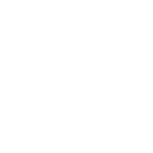
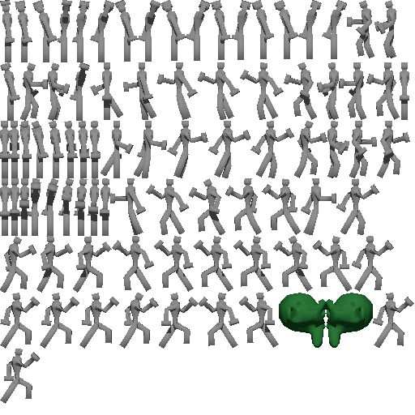

# AssetBuilder

This repo is used for generating assests used in games. 

## Features
- `font-map` will take in a string of characters, a TTF font and a location. From there it will rasterize all characters to a spritesheet.
- - `font-map {TTF_FILE} {TEXT_TO_RENDER} {OUTPUT_DIR} [--font-scale {FLOAT}]`
- `blend2sheet` will take in a Blender file, a view type, and generate a spritesheet based on the animations included if they exist. The resulting file will be a power of 2 to minimize GPU hiccups.
- - `blend2sheet {BLENDER_FILE} {OUTPUT_DIR} {SPRITE_WIDTH} {SPRITE_HEIGHT} [sidescroller isometric top-down advance-wars-battle pokemon-battle camera] [--num-rotations {INT}] [--animations {CSV_ANIMATION_LIST}]`
- - - `sidescroller` view type renders the sprite in a platformer view
- - - `isometric` view type renders the sprite in an isometric view
- - - `top-down` view type renders the sprite in a top down view
- - - `advance-wars-battle` view type renders the sprite in a side view seen in Advance Wars battles
- - - `pokemon-battle` view type renders the sprite in two views: a front and back view. This is what is typically seen during Pokemon Fire Red for example.
- - - `internal-camera` view type simply uses the Blender camera and all its settings.
- - - `--num-rotations INT` is an optional argument that is only applicable for isometric views. 
- - - `--animations CSV_ANIMATIONS_LIST` is an optional argument that takes a CSV list of animations. When provided it will only render those animations.
- - - If there are errors, try deleting all default lights as well as any default cameras.
- `mega-sheet` will take in a directory of Blender files, a view type, and generate a spritesheet based on the animations included if they exist. The resulting file will be a power of 2 to minimize GPU hiccups.
- - `blend2sheet {SOURCE_DIR} {OUTPUT_DIR} {SPRITE_WIDTH} {SPRITE_HEIGHT} [sidescroller isometric top-down advance-wars-battle pokemon-battle camera] [--num-rotations {INT}]`
- - - `sidescroller` view type renders the sprite in a platformer view
- - - `isometric` view type renders the sprite in an isometric view
- - - `top-down` view type renders the sprite in a top down view
- - - `advance-wars-battle` view type renders the sprite in a side view seen in Advance Wars battles
- - - `pokemon-battle` view type renders the sprite in two views: a front and back view. This is what is typically seen during Pokemon Fire Red for example.
- - - `internal-camera` view type simply uses the Blender camera and all its settings.
- - - `--num-rotations INT` is an optional argument that is only applicable for isometric views. 
- - - If there are errors, try deleting all default lights as well as any default cameras.

## Examples
Look at the `Makefile` to see a list of example invocations. 

### font-map

When this command is ran, a densely packed spritesheet of characters and JSON mapping will be generated. The texture will be sized to a power of 2 on the width and height and each sprite will be cropped to minimize empty space. 

Each JSON file will have the total width, the height, as well as the name.

It will have a `sprites` field which will contain a list of frames for each character.

For each frame, the `x` and `y` fields map to the location on the spritesheet image, the `width` and `height` fields map to the size of the sprite on the spritesheet image.
The `center_offset_x` and `center_offset_y` are used to get the center of the sprite.
The `top_left_offset_x` can be added to get it to the original width and `top_left_offset_y` can be added to get it to the original height.

Example JSON file:
```
{
  "width": 256,
  "height": 256,
  "name": "font_atlas",
  "sprites": {
    "0": [
      {
        "center_offset_x": 10,
        "center_offset_y": 24,
        "top_left_offset_x": 16,
        "top_left_offset_y": 16,
        "x": 161,
        "y": 47,
        "width": 23,
        "height": 35
      }
    ],
    "Z": [
      {
        "center_offset_x": 9,
        "center_offset_y": 24
        "top_left_offset_x": 16,
        "top_left_offset_y": 16,,
        "x": 0,
        "y": 189,
        "width": 25,
        "height": 35
      }
    ],
    // etc...
  }
}
```

Example image file:



Both can be located at `data/example_font-map` or by running the `font-map` commands in `Makefile`.


### blend2sheet

When this command is ran, a densely packed spritesheet and JSON mapping will be generated. The texture will be sized to a power of 2 on the width and height and each sprite will be cropped to minimize empty space. 

Each JSON file will have the total width, the height, as well as the name.

It will have a `sprites` field which will contain a list of frames for each animation.

For each frame, the `x` and `y` fields map to the location on the spritesheet image, the `width` and `height` fields map to the size of the sprite on the spritesheet image.
The `center_offset_x` and `center_offset_y` are used to get the center of the sprite.
The `top_left_offset_x` can be added to get it to the original width and `top_left_offset_y` can be added to get it to the original height.

Example JSON file:
```
{
  "width": 2048,
  "height": 2048,
  "name": "Animated",
  "sprites": {
    "Animated.Isometric.Walk.rotation-0": [
      {
        "center_offset_x": 94,
        "center_offset_y": 60,
        "top_left_offset_x": 16,
        "top_left_offset_y": 16,
        "x": 1040,
        "y": 1262,
        "width": 68,
        "height": 131
      },
      {
        "center_offset_x": 93,
        "center_offset_y": 60,
        "x": 1483,
        "y": 1525,
        "width": 68,
        "height": 127
      }
    ],
    "Animated.Isometric.Walk.rotation-1": [
      {
        "center_offset_x": 94,
        "center_offset_y": 60,
        "top_left_offset_x": 16,
        "top_left_offset_y": 16,
        "x": 1040,
        "y": 1262,
        "width": 68,
        "height": 131
      },
      {
        "center_offset_x": 93,
        "center_offset_y": 60,
        "x": 1483,
        "y": 1525,
        "width": 68,
        "height": 127
      }
    ],
    // etc...
  }
}
```

Example image file:


Both can be located at `data/example_blend2sheet` or by running the `blend2sheet` commands in `Makefile`.


### mega-sheet

When this command is ran, a densely packed spritesheet and JSON mapping will be generated for all Blender files found. The texture will be sized to a power of 2 on the width and height and each sprite will be cropped to minimize empty space. 

Each JSON file will have the total width, the height, as well as the name.

It will have a `sprites` field which will contain a list of frames for each animation.

For each frame, the `x` and `y` fields map to the location on the spritesheet image, the `width` and `height` fields map to the size of the sprite on the spritesheet image.
The `center_offset_x` and `center_offset_y` are used to get the center of the sprite.
The `top_left_offset_x` can be added to get it to the original width and `top_left_offset_y` can be added to get it to the original height.

Example JSON file:
```
{
  "width": 2048,
  "height": 2048,
  "name": "Animated",
  "sprites": {
    "Animated.Isometric.Walk.rotation-0": [
      {
        "center_offset_x": 94,
        "center_offset_y": 60,
        "top_left_offset_x": 16,
        "top_left_offset_y": 16,
        "x": 1040,
        "y": 1262,
        "width": 68,
        "height": 131
      },
      {
        "center_offset_x": 93,
        "center_offset_y": 60,
        "top_left_offset_x": 16,
        "top_left_offset_y": 16,
        "x": 1483,
        "y": 1525,
        "width": 68,
        "height": 127
      }
    ],
    "Animated.Isometric.Walk.rotation-1": [
      {
        "center_offset_x": 94,
        "center_offset_y": 60,
        "top_left_offset_x": 16,
        "top_left_offset_y": 16,
        "x": 1040,
        "y": 1262,
        "width": 68,
        "height": 131
      },
      {
        "center_offset_x": 93,
        "center_offset_y": 60,
        "top_left_offset_x": 16,
        "top_left_offset_y": 16,
        "x": 1483,
        "y": 1525,
        "width": 68,
        "height": 127
      }
    ],
    // etc...
  }
}
```

Example image file:



Both can be located at `data/example_megasheet` or by running the `mega-sheet` commands in `Makefile`.